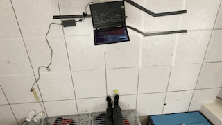
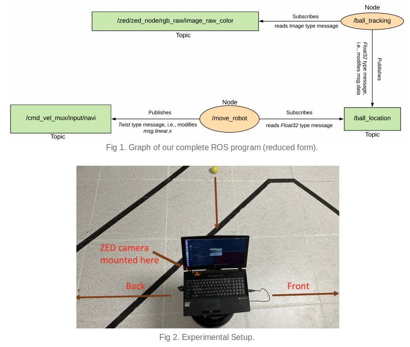

# A Goalkeeping Turtlebot implemented in ROS
This is a part of my small effort in creating some basic projects implemented in ROS. As I am totally new at learning ROS, feel free to give constructive comments. If you are absolutely new at learning ROS, it might help you. You may use the codes as-is. 

## Introduction 
In this project, we develop a vision-based goalkeeping robot that mimics the role of a soccer goalkeeper.
Simple image processing techniques have been performed to detect a ball based on its intensity values.
Based on the location of ball in the pixel domain, we develop an algorithm to move the robot either
forward or backward to stop the moving ball going inside a goal post.

## Pre-requisites
- Ubuntu 16.04
- Python 2 
- [ROS Kinetic Kame](http://wiki.ros.org/kinetic/Installation/Ubuntu)
- Turtlebot 2 (should work with Turtlebot 3 as well, however, you may have to change Topic names)
- [CUDA Toolkit 10.0](https://developer.nvidia.com/cuda-downloads)
- [ZED camera SDK v2.8.4](https://www.stereolabs.com/developers/release/) (should work with any other camera, however, again you may have to change Topic names)
- [OpenCV](https://pypi.org/project/opencv-python/3.3.1.11/)
- [CvBridge](http://wiki.ros.org/cv_bridge)

To install Turtlebot 2 packages the following procedure can be followed, however, please check other resources online.
```
sudo apt-get install -y linux-headers-generic
sudo sh -c 'echo "deb-src http://us.archive.ubuntu.com/ubuntu/ xenial main restricted deb-src http://us.archive.ubuntu.com/ubuntu/ xenial-updates main restricted deb-src http://us.archive.ubuntu.com/ubuntu/xenial-backports main restricted universe multiverse deb-src http://security.ubuntu.com/ubuntu xenial-security main restricted" > \/etc/apt/sources.list.d/official-source-repositories.list'
sudo apt-get update
sudo apt-get install ros-kinetic-librealsense
sudo apt-get install ros-kinetic-turtlebot
sudo apt-get install ros-kinetic-turtlebot-apps
sudo apt-get install ros-kinetic-turtlebot-interactions
sudo apt-get install ros-kinetic-turtlebot-simulator
sudo apt-get install ros-kinetic-ar-track-alvar-msgs
```


## Installation
```
cd ~/catkin_ws/src
git clone https://github.com/enansakib/goalkeeping-turtlebot.git
cd ~/catkin_ws
catkin_make
```

## Usage
```
roslaunch turtlebot_bringup minimal.launch
roslaunch zed_wrapper zed.launch
roslaunch goalkeeping-turtlebot turtlebotgk.launch
```

## Demo
 


## Details
The code inside the `src` folder already has necessary comments to understand what's going on. 

The project consists of 2 ROS nodes: ball_tracking and move_robot. ball_tracking node reads Image type messages from the ZED camera topic and converts them to BGR8 format to perform image processing using OpenCV libraries. The conversion is done using [cv_bridge](http://wiki.ros.org/cv_bridge). We follow the same image processing techniques as this [amazing tutorial](https://www.pyimagesearch.com/2015/09/14/ball-tracking-with-opencv/) to detect the ball with some additional consistency checks. Then we publish valid detections to a ROS topic.

Then the move_robot node reads these messages and make decision whether to move the robot or not in order to stop the ball going inside the goal post. Concretely, if the ball is on the right side of the image then the robot goes forward and if the ball is on the left side of the image then it goes backward. If the ball is in the middle, the robot stops. We have used a linear speed function to avoid abrupt speed changing. 

Fig. 1 and 2 show the overall workflow of this project and the project setup, respectively.


## Reference
1. https://www.pyimagesearch.com/2015/09/14/ball-tracking-with-opencv/
2. http://wiki.ros.org/ROS/Tutorials
3. https://www.stereolabs.com/docs/ros/
